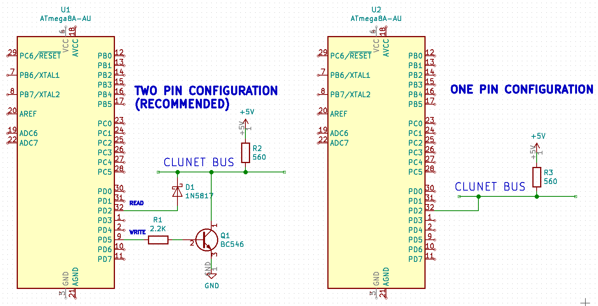

## avr-dmbs-lib

This is CLUNET protocol implementation for [Microchip/Atmel AVR](https://www.microchip.com/design-centers/8-bit/avr-mcus/get-started-now) family microcontrollers as [DMBS](https://github.com/abcminiuser/dmbs) module.

* based on [original version](https://github.com/ClusterM/clunet)  by [Alexey Avdyukhin a.k.a. Cluster](https://clusterrr.com/) 
* **modification: new frame detection by interframe window >= 5T instead long start pulse 10T**
* very easy to configure in **clunet_config.h** file
* written on pure assembler (provided **C language API with GCC ABI**, required: [AVR 8-bit GNU Toolchain](https://www.microchip.com/mplab/avr-support/avr-and-arm-toolchains-c-compilers), GNU Make, [DMBS](https://github.com/abcminiuser/dmbs))
* highly flexible configurable bootloader support (also may work on MCUs without bootloader and RWW-section support using some tricks)

